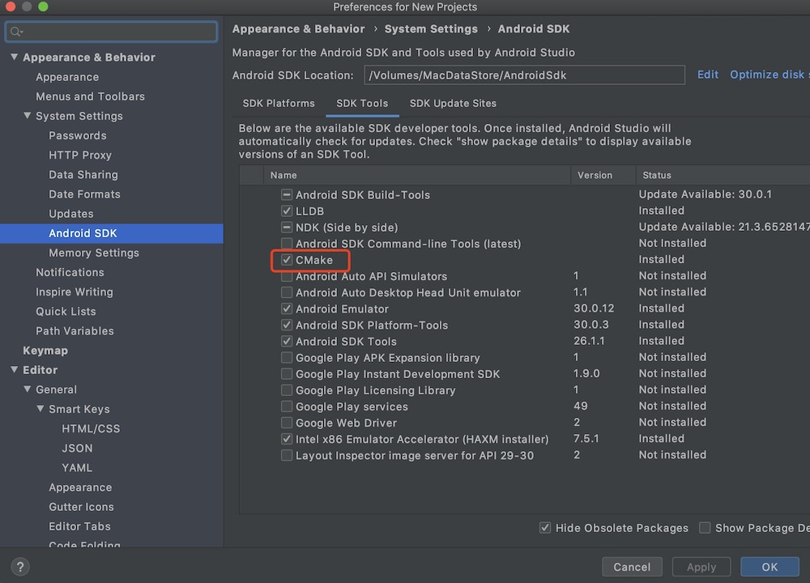
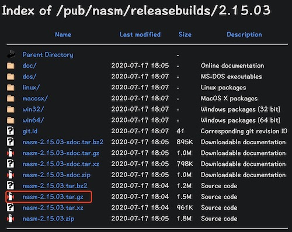
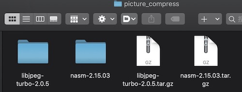
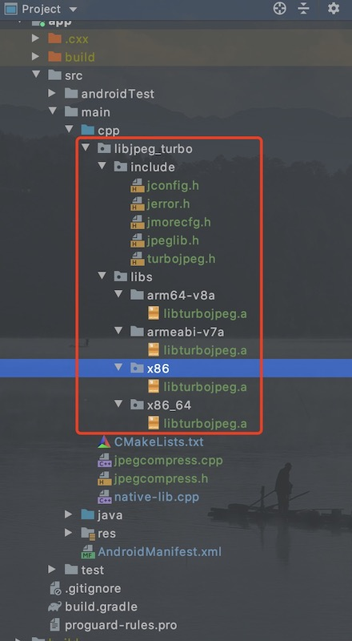

# <center>libjpeg-turbo编译<center>

<font color=red size = 5> 注意: 以下步骤只使用于 mac 或者 linux</font>

## 1. `libjpeg-turbo` 函数库下载解压：

从 [libjpeg-turbo/libjpeg-turbo](https://github.com/libjpeg-turbo/libjpeg-turbo) GitHub 项目的 [Release 发布版本页面](https://github.com/libjpeg-turbo/libjpeg-turbo/releases) 下载 Release 版本的源码 , 这里下载最新的 <font color=red>Source code (tar.gz)</font> 源码 ;

然后`解压源码`

## 2. 编译前一些工具环境的准备

### 2.1 CMake 工具 : 安装 2.8.12 以上的 CMake 工具

AndroidStudio 进行NDK开发时会下载Cmake,下载目录是在 `{AndroidSdk目录下}\cmake` 中.请看下图:



- 还可以直接去 cmake 官网下载

最后 <font color = blue size = 5>注意设置 cmake 的环境变量</font>

mac的步骤如下

1. 终端执行 `open ~/.bash_profile`
2. 配置cmake变量
    ```
    ##Cmake
    export CmakeHome=/Volumes/MacDataStore/AndroidSdk/cmake/3.10.2.4988404
    export PATH=${PATH}:${CmakeHome}/bin
    ```
3. 配置完毕之后执行 `source ~/.bash_profile`

### 2.2 Clang编译器和JDK工具

1. JDK安装1.5以上的,并配置环境变量(<font color=red> 这个不需要说了噻</font>)
2. Clang 编译器,在NDK目录中默认有的哦

### 2.3 NASM 汇编工具

#### 2.3.1. [NASM 下载地址](https://www.nasm.us/pub/nasm/releasebuilds/?C=M;O=D)
选择最新的发布版本 ,最好不要选 \*\*rc\* 的版本;进去后选择 ` nasm-\*\*\*.tar.gz 压缩包 ` 下载




####  2.3.2. 将 NASM 源码 解压到 和 libjpeg-turbo 源码同一目录下,我的是在 `picture_compress` 目录下



####  2.3.3 编译安装 nasm

1. 生成 Makefile 文件 : 进入 nasm-2.15 目录 , 执行 ./configure 命令 , 先生成 Makefile 文件 ;
```
wangjiemindeMBP:nasm-2.15.03 east$ ./configure
```

执行上述命令 , 最终会生成 Makefile 文件 ;

```
wangjiemindeMBP:nasm-2.15.03 east$ ./configure 
checking for prefix by checking for nasm... no
checking build system type... x86_64-pc-linux-gnu
checking host system type... x86_64-pc-linux-gnu
checking for gcc... gcc

// ... 省略一万行 

checking if gcc supports C99 external inlines... yes
configure: creating ./config.status
config.status: creating Makefile
config.status: creating doc/Makefile
config.status: creating config/config.h
root@octopus:~/picture_compress/nasm-2.15# 

```

2. 编译安装 : 在picture_compress/nasm-2.15.0.3 目录下执行 make install 命令 , 编译安装 nasm-2.15 汇编工具 ;

```
wangjiemindeMBP:nasm-2.15.03 east$ make install
```

编译完成后 , 该工具即可使用 ;

```
wangjiemindeMBP:nasm-2.15.03 east$ make install
gcc -c  -g -O2 -fwrapv -U__STRICT_ANSI__ -fno-common -Werror=attributes -ffunction-sections -fdata-sections -fvisibility=hidden -Wall -W -pedantic -Wc90-c99-compat -Wno-long-long -Wno-shift-negative-value -Werror=implicit -Werror=missing-braces -Werror=return-type -Werror=trigraphs -Werror=pointer-arith -Werror=missing-prototypes -Werror=missing-declarations -Werror=comment -Werror=vla -DHAVE_CONFIG_H -I. -I. -I./include -I./include -I./x86 -I./x86 -I./asm -I./asm -I./disasm -I./disasm -I./output -I./output -o asm/nasm.o asm/nasm.c

// 省略 ...

I./output -I./output -Wl,--gc-sections -o ndisasm disasm/ndisasm.o libnasm.a 
/bin/mkdir -p /usr/local/bin
/usr/bin/install -c nasm /usr/local/bin/nasm
/usr/bin/install -c ndisasm /usr/local/bin/ndisasm
/bin/mkdir -p /usr/local/share/man/man1
/usr/bin/install -c -m 644 ./nasm.1 /usr/local/share/man/man1/nasm.1
/usr/bin/install -c -m 644 ./ndisasm.1 /usr/local/share/man/man1/ndisasm.1
root@octopus:~/picture_compress/nasm-2.15# 

```

## 3. 编译 Android 平台使用的 libjpeg-turbo 函数库

###  3.1 在`libjpeg-turbo`目录下创建编译的输出目录

在`libjpeg-turbo`目录下创建:

- android_arm64-v8a 文件夹: 对应`arm64-v8a`版本
- android_armeabi-v7a 文件夹: 对应`armeabi-v7a`版本
- android_x86 文件夹: 对应`x86`版本
- android_x86_64 文件夹: 对应`x86_64`版本

### 3.2 创建编译脚本

在 libjpeg-turbo 目录下创建 `build.sh`文件,粘贴以下内容

```
# 设置 NDK 的目录 , 这里使用 ndk-r16b 版本
NDK_PATH=/Volumes/MacDataStore/AndroidSdk/ndk/21.2.6472646

# 设置 NDK 的交叉编译工具链 , 这里特别注明 , 只能使用 NDK r16b 或者之前的版本 
TOOLCHAIN=clang

# Android 的最低兼容版本 
ANDROID_VERSION=16

# 进入最终编译生成编译结果目录  (注意:对应上一步的目录)
cd /Volumes/E/picture_compress/libjpeg-turbo-2.0.5/android_x86_64

# 设置 源码目录 最后的 /root/picture_compress/libjpeg-turbo-2.0.5 就是源文件所在目录
cmake -G"Unix Makefiles" \
  -DANDROID_ABI=x86_64 \  (注意:对应上一步目录对应的版本)
  -DANDROID_ARM_MODE=arm \
  -DANDROID_PLATFORM=android-${ANDROID_VERSION} \
  -DANDROID_TOOLCHAIN=${TOOLCHAIN} \
  -DCMAKE_ASM_FLAGS="--target=arm-linux-androideabi${ANDROID_VERSION}" \
  -DCMAKE_TOOLCHAIN_FILE=${NDK_PATH}/build/cmake/android.toolchain.cmake \
  /Volumes/E/picture_compress/libjpeg-turbo-2.0.5
make

```

修改权限执行脚本

```
$ chmod -R 777 build.sh
$ ./build.sh
```

注意: <font color = red size = 5>脚本修改对应的 输出目录 和 版本重新编译就能得到对应版本的编译出来的 libturbojpeg.a 文件</font>


## 4. 拷贝需要的文件到 `AS` 中



- `include` 中的头文件在 `libjpeg-turbo` 目录下找,其中 `jconfig.h` 在编译输出的目录下,随便拷贝一个就行
- libs 下的各版本的`.a` 文件 在各版本的输出目录下就能找到

接下来看看我的 `CMakeLists.txt` 文件

```

cmake_minimum_required(VERSION 3.4.1)

# include 头文件
include_directories(libjpeg_turbo/include)

# 设置输出路径为项目目录下 (PROJECT_SOURCE_DIR : cmake.txt所在目录)
set(CMAKE_LIBRARY_OUTPUT_DIRECTORY ${PROJECT_SOURCE_DIR}/../../../../jniLibs/${CMAKE_ANDROID_ARCH_ABI})

add_library( # Sets the name of the library.
             native-lib
             SHARED
             native-lib.cpp
             jpegcompress.cpp
        )

add_library(libjpeg STATIC IMPORTED)
set_target_properties(libjpeg
        PROPERTIES IMPORTED_LOCATION
        ${CMAKE_SOURCE_DIR}/libjpeg_turbo/libs/${CMAKE_ANDROID_ARCH_ABI}/libturbojpeg.a)

find_library( # Sets the name of the path variable.
              log-lib
              log )


target_link_libraries( # Specifies the target library.
                       native-lib
                       # Android Bitmap需要的库
                       jnigraphics
                       # libjpeg-turbo 压缩图片
                       libjpeg
                       ${log-lib} )
```


